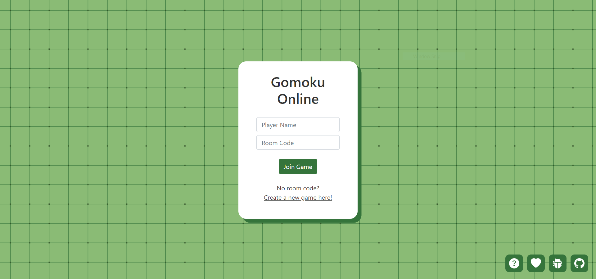
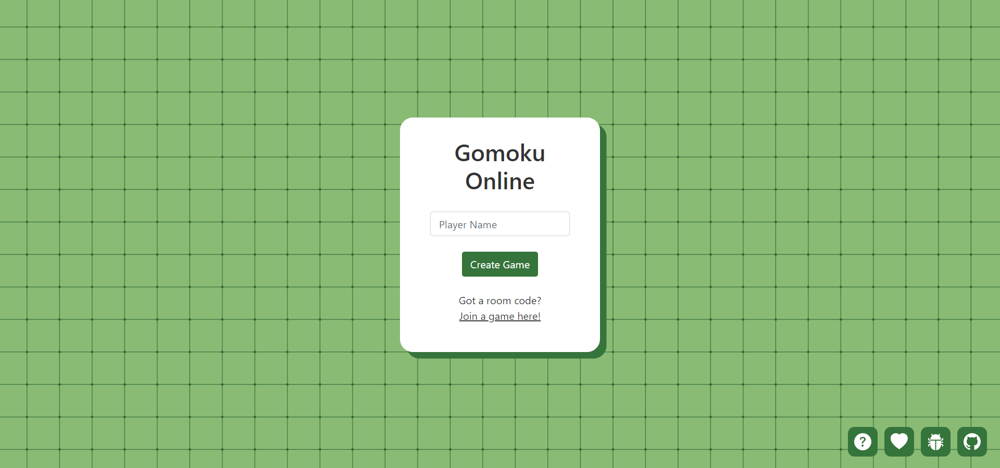
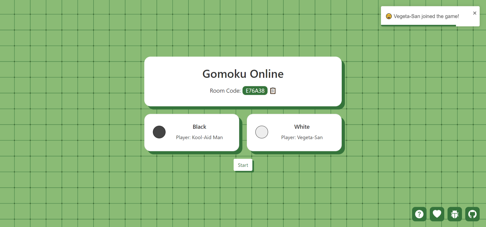
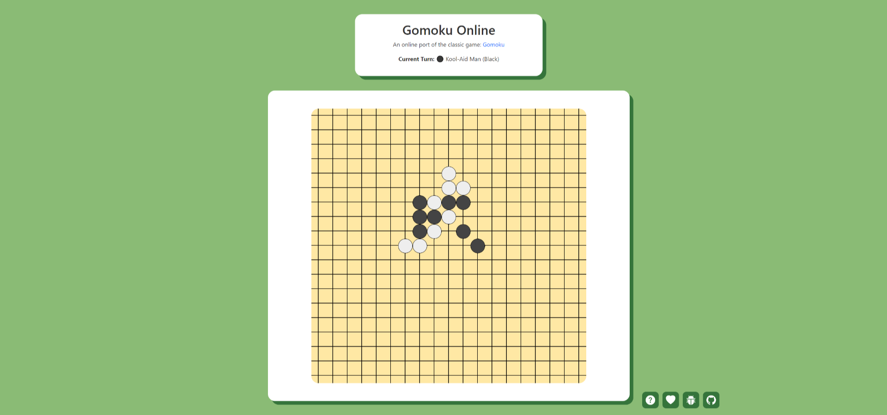
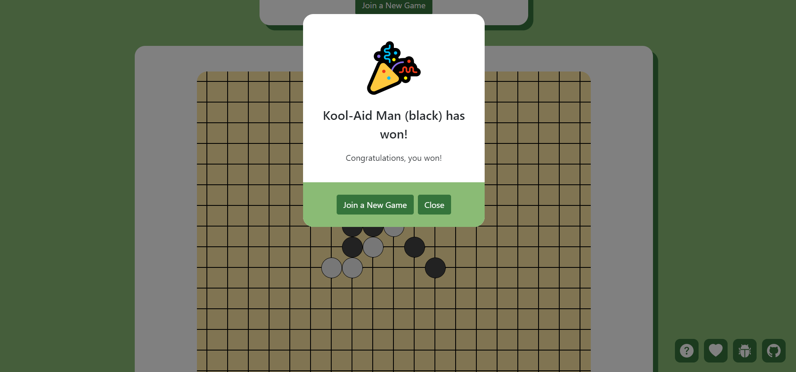
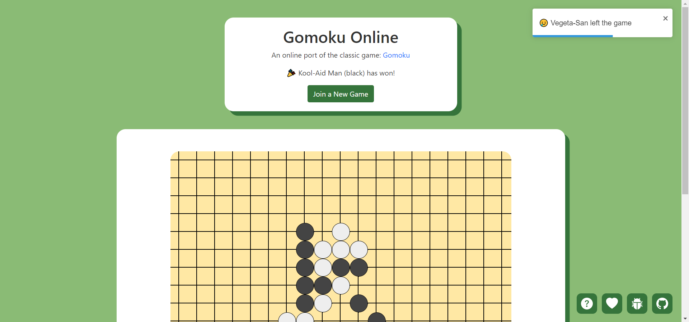

# Gomoku Online

An online multiplayer port of the classic 2-player board game: [Gomoku](https://en.wikipedia.org/wiki/Gomoku), built using React.js, Node.js, Express.js and Socket.io. 

[Play the live version of the game here!](https://gomoku-online.netlify.app/)

  

  

## :star: Introduction 

Growing up, one of my favourite board games was Gomoku. I have lots of fond memories playing against family and friends in this simple yet satisfying game. After the COVID-19 pandemic hit in 2020, I really began to feel the isolation from my friends and family. Inspired to combat this physical distance in my social circles, I decided to create an online version of Gomoku, allowing me to play against my family and friends no matter where they are located.

Although this may be a simple 2-player game, it holds a special place in my heart, and I hope that it will bring joy to anyone else who happens to use this game as a source of connection with others. :relaxed:

## :sparkles: Features

* **Interactive web game version of Gomoku**
	- Say good-bye to the days of physical stones and boards!   

* **Real-time, live multiplayer interactions**
	- With the help of socket.io, all moves played by one player will be immediately reflected on the other player’s screen. 
	- The goal is to make it feel like you are playing against your friend as if they were sitting right across from you. 

* **Join or create your own rooms** 
	- Easily create your own room with the automatic generation of a unique 6-digit code. 
	- Share this code with your desired friend/opponent using the built-in clipboard copy button.
	- Either player can start the game when both players have joined the room.

* **Individualized connections**
	- With the use of socket.io, the backend is able to send individualized information to each client. 
	- This ensures that each client receives only the information that they need to see, nothing more, nothing less. 

## :computer: Tech Stack

- **Front-end**: [React.js](https://reactjs.org/), [Bootstrap](https://getbootstrap.com/)
- **Back-end**: [Node.js](https://nodejs.org/en/), [Express.js](https://expressjs.com/)
- **Deployment**: [Netlify](https://www.netlify.com/) (client-end), [Heroku](https://www.heroku.com/) (server-side)
- **Other Technologies Used:** [Socket.io](https://socket.io/)

## :raised_hands: Online Multiplayer Version

You can [play the live multiplayer version of the game here!](https://gomoku-online.netlify.app/)

The game is currently hosted using Netlify and Heroku. 

## :wave: Local 2 Player Version

To run the local 2 player version of the game, please follow these steps:

1. Download/clone the `Local 2 Player` release of this repository
2. Navigate to the root directory 
3. Run `npm install`
4. Run `npm start`
5. Visit `http://localhost:3000/` and enjoy the game locally!